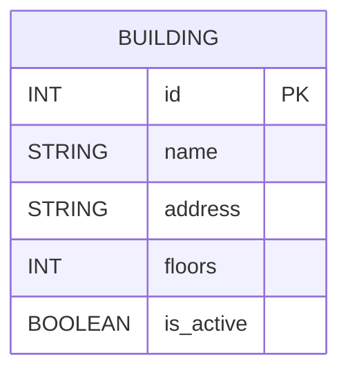

[doc.md](https://github.com/user-attachments/files/28467482/doc.md)
# Вариант №16. Campus Service (Сервис корпусов)

## Добавить корпус

Информация требуемая для создания корпуса

| Параметр                    |Пояснение| Обязательность | Тип         | Ограничение          | Значение по умолчанию |
| --------------------------- |--------------| -------------- | ----------- | -------------------- | --------------------- |
| name | Название корпуса | Обязательно    | Строка      | от 1 до 100 символов |                       |
| address            | Адрес корпуса | Обязательно    | Строка      | от 1 до 255 символов |                       |
| floors         | Количество этажей в корпусе | Обязательно    | Целое число | больше 0             |                       |

Комбинация параметров `Наименование корпуса` и `Адрес` должна быть уникальной.

Выходные данные

| Параметр             | Тип            |
| -------------------- | -------------- |
| id                   | Целое число    |
| name | Строка         |
| address              | Строка         |
| floors            | Целое число    |
| is_active            | Логический тип |

---

## Изменить корпус по ID

Входные параметры

| Параметр                   |Пояснение| Обязательность | Тип         | Ограничение          |
| --------------------------- |--------------| -------------- | ----------- | -------------------- |
| name | Название корпуса | Нет            | Строка      | от 1 до 100 символов |
| address | Адрес корпуса | Нет            | Строка      | от 1 до 255 символов |
| floors | Адрес корпуса | Нет            | Целое число | больше 0             |

Выходные данные

| Параметр             | Тип            |
| -------------------- | -------------- |
| id                   | Целое число    |
| name | Строка         |
| address               | Строка         |
| floors            | Целое число    |
| is_active            | Логический тип |

---

## Удаление корпуса по ID

Вернет истинно (`True`), если корпус был закрыт (удален), иначе ложно (`False`).

Удаление реализуется через поле `is_active`.

---

## Информация о корпусе по ID

Информация о корпусе для пользователя

| Параметр             | Тип            |
| -------------------- | -------------- |
| id                   | Целое число    |
| name | Строка         |
| address                | Строка         |
| floors            | Целое число    |
| is_active            | Логический тип |

---

## Информация о корпусах

Параметры запроса

| Параметр                 | Тип         | Описание                 |
| ------------------------ | ----------- | ------------------------ |
| name     | Строка      | поиск по названию        |
| address                    | Строка      | поиск по адресу          |
| floors (точное число) | Целое число | ровно указанное значение |
| floors_from (от)           | Целое число | минимальное значение     |
| floors_to (до)           | Целое число | максимальное значение    |

Результат содержит только активные корпуса.

Информация о корпусах для пользователя

| Параметр             | Тип         |
| -------------------- | ----------- |
| id                   | Целое число |
| name | Строка      |
| address                | Строка      |
| floors            | Целое число |

---

## ER-диаграмма

