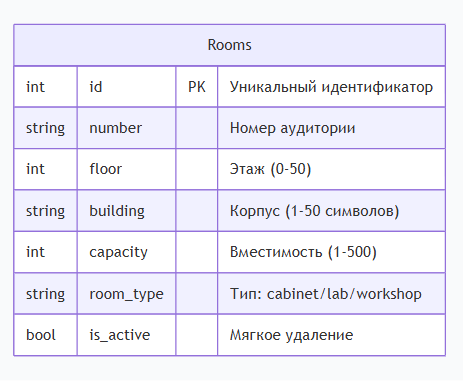

# Вариант 17. Room Service - Сервис аудиторий

## 1. Информация, требуемая для создания аудитории (CREATE)

| Параметр | Пояснение | Обязательность | Тип | Ограничение | Значение по умолчанию |
|----------|-----------|----------------|------|-------------|----------------------|
| number | Номер аудитории | Да | string | 1-20 символов | - |
| floor | Этаж | Да | integer | от -2 до 25 | - |
| capacity | Вместимость (мест) | Да | integer | от 1 до 500 | - |
| building_id | ID корпуса | Да | integer | внешний ключ | - |
| has_computers | Наличие компьютеров | Нет | boolean | True/False | False |
| is_active | Активность записи | Нет | boolean | True/False | True |

**Уникальные комбинации параметров:**
- `(number, building_id)` — в одном корпусе не может быть двух аудиторий с одинаковым номером

## 2. Информация, возвращаемая при успешном создании

| Параметр | Тип |
|----------|------|
| id | integer |
| number | string |
| floor | integer |
| capacity | integer |
| building_id | integer |
| has_computers | boolean |
| is_active | boolean |

## 3. Информация, требуемая для изменения аудитории по ID (UPDATE)

| Параметр | Пояснение | Обязательность | Тип | Ограничение |
|----------|-----------|----------------|------|-------------|
| number | Номер аудитории | Нет | string | 1-20 символов |
| floor | Этаж | Нет | integer | от -2 до 25 |
| capacity | Вместимость | Нет | integer | от 1 до 500 |
| building_id | ID корпуса | Нет | integer | внешний ключ |
| has_computers | Наличие компьютеров | Нет | boolean | True/False |
| is_active | Активность записи | Нет | boolean | True/False |

## 4. Информация, возвращаемая при успешном изменении

| Параметр | Тип |
|----------|------|
| id | integer |
| number | string |
| floor | integer |
| capacity | integer |
| building_id | integer |
| has_computers | boolean |
| is_active | boolean |

## 5. Удаление аудитории по ID (DELETE)

Вернет `True`, если аудитория была закрыта (удалена), иначе вернет `False`.  
Фактически запись из БД не удаляется, а реализуется через булевое поле `is_active`.

## 6. Получение аудитории по ID (GET by ID)

| Параметр | Пояснение | Тип |
|----------|-----------|------|
| id | Идентификатор аудитории | integer |
| number | Номер аудитории | string |
| floor | Этаж | integer |
| capacity | Вместимость | integer |
| building_id | ID корпуса | integer |
| has_computers | Наличие компьютеров | boolean |
| is_active | Активность записи | boolean |

## 7. Получение списка аудиторий по заданным параметрам (LIST)

### 7.1. Параметры фильтрации

| Параметр | Пояснение | Тип |
|----------|-----------|------|
| number | Номер аудитории (частичное совпадение) | string |
| floor | Этаж | integer |
| min_capacity | Минимальная вместимость | integer |
| max_capacity | Максимальная вместимость | integer |
| building_id | ID корпуса | integer |
| has_computers | Наличие компьютеров | boolean |
| is_active | Активность записи | boolean |
| limit | Количество записей на странице | integer |
| offset | Смещение для пагинации | integer |

### 7.2. Возвращаемая информация (список)

| Параметр | Тип |
|----------|------|
| id | integer |
| number | string |
| floor | integer |
| capacity | integer |
| building_id | integer |
| has_computers | boolean |
| is_active | boolean |

## 8. ER-диаграмма

### Описание связей:
- **Building (Корпус) 1 : N Room (Аудитория)** — один корпус может содержать много аудиторий
- **Room N : N Equipment (Оборудование)** — многие ко многим через транзитивную таблицу `RoomEquipment`

### Таблицы:
1. **Building** — корпуса
2. **Room** — аудитории
3. **Equipment** — оборудование
4. **RoomEquipment** — связь аудиторий и оборудования
