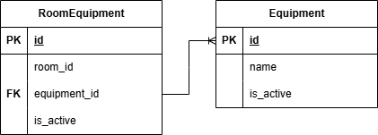

### Вариант 18. Room Equipment Service (Сервис оборудования)

### Создание оборудования
| Параметр | Пояснение | Обязательность | Тип | Ограничение | Значение по умолчанию |
|---|---|---|---|---|---|
| name | Название единицы оборудования | обязательно | строка | меньше 256 символов | |

`is_active` выставляется автоматически при создании оборудования в состояние True.

`id` создаются в БД автоматически.

Уникальных комбинаций нет.

В случае удачного создания оборудования возвращается:
| Параметр | Тип |
|---|---|
| id | целое число |
| name | строка |
| is_active | булевое значение |

### Привязать оборудование к кабинету
Установление связи между существующим оборудованием и кабинетом.

| Параметр | Пояснение | Обязательность | Тип | Ограничение |
|---|---|---|---|---|
| id | id оборудования | обязательно | целое число | |
| room_id | id кабинета | обязательно | целое число | Больше 0 |

Оборудование добавляется в кабинет.

В случае удачного изменения списка оборудования возвращается:
| Параметр | Тип |
|---|---|
| id | целое число |
| name | строка |
| room_id | целое число |
| is_active | булевое значение |

### Удалить оборудование по id оборудования
Данные из БД не удаляются, удалённым (неактивным) данным присваивается статус `is_active` в значение False.

Удаляется оборудование.

Вернёт True, если оборудование было успешно удалено, иначе False

### Отвязать оборудование от кабинета по id оборудования
Данные из БД не удаляются, удалённым (неактивным) данным присваивается статус `is_active` в значение False.

Убирает привязку оборудования к кабинету.

Вернёт True, если оборудование было успешно удалено, иначе False

### Получить оборудование по id кабинета
Информация возвращаемая в случае удачного получения в виде списка всего оборудования кабинета:
| Параметр | Пояснение | Тип |
|---|---| --- |
| id |  id оборудования | целое число |
| name | название оборудования | строка |
| room_id | id кабинета | целое число |
| is_active | статус | булевое значение |

### Получить список оборудования по параметрам
| Параметр | Пояснение | Тип |
|---|---|---|
| room_id | Точный поиск | целое число |
| ids | Поиск по одному или нескольким id оборудования | список целых чисел |
| is_active | Поиск по статусу доступности оборудования | булевое значение |

Информация возвращается в виде массива объектов, где каждый объект описывает одну единицу оборудования:
| Параметр | Тип |
|---|---|
| id | целое число |
| name | строка |
| room_id | целое число |
| is_active | булевое значение |

### ERD
В таблице RoomEquipment храниться связь между оборудованием и кабинетом и статус связи между ними.

В таблице Equipment хранится само оборудование и его статус.

