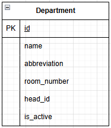

**Вариант №5. Сервис факультетов/отделений**

**Добавить отделение**  
Информация, требуемая для создания отделения

| Параметр | Пояснение | Обязательность | Тип | Ограничение | Значение по умолчанию |
| :---- | :---- | :---- | :---- | :---- | :---- |
| name | Полное наименование отделения | Обязательно | Строка | Уникальное, максимум 150 символов | — |
| abbreviation | Краткая аббревиатура отделения | Обязательно | Строка | Уникальное, максимум 20 символов | — |
| room_number | Номер кабинета отделения | Обязательно | Целое число | Больше 0 | — |
| head_id | Идентификатор заведующего (ссылка на внешний сервис сотрудников) | Обязательно | Целое число | Больше 0 | — |

Уникальные комбинации параметров:
- `name` должно быть полностью уникальным
- `abbreviation` должно быть полностью уникальным

Информация, возвращаемая в случае успешного создания отделения:

| Параметр | Тип |
| :---- | :---- | 
| id | Целое число | 
| name | Строка | 
| abbreviation | Строка | 
| room_number | Целое число | 
| head_id | Целое число | 
| is_active | Логический | 

Примечание: Поле `is_active` не передаётся при создании сущности, а возвращается только в ответе.

**Изменить отделение по ID**
Входные параметры

| Параметр | Пояснение | Обязательность | Тип | Ограничение |
| :---- | :---- | :---- | :---- | :---- |
| name | Полное наименование отделения | Опционально | Строка | Уникальное, максимум 150 символов |
| abbreviation | Краткая аббревиатура отделения | Опционально | Строка | Уникальное, максимум 20 символов |
| room_number | Номер кабинета отделения | Опционально | Целое число | Больше 0 |
| head_id | Идентификатор заведующего | Опционально | Целое число | Больше 0 |
| is_active | Статус активности отделения | Опционально | Логический | true/false |

Выходные параметры

| Параметр | Тип |
| :---- | :---- |
| id | Целое число |
| name | Строка |
| abbreviation | Строка |
| room_number | Целое число |
| head_id | Целое число |
| is_active | Логический |

**Удаление отделения по ID**
Информация, возвращаемая при удалении отделения:

| Возвращаемое значение | Тип | Пояснение |
| :---- | :---- | :---- |
| `true` | Логический | Отделение успешно удалено |
| `false` | Логический | Отделение не найдено или уже неактивно |

**Получить отделение по ID**
Информация, возвращаемая в случае успешного поиска отделения по ID:

| Параметр | Пояснение | Тип |
| :---- | :---- | :---- |
| id | Уникальный идентификатор отделения | Целое число |
| name | Полное наименование отделения | Строка |
| abbreviation | Краткая аббревиатура отделения | Строка |
| room_number | Номер кабинета отделения | Целое число |
| head_id | Идентификатор заведующего отделением | Целое число |
| is_active | Статус активности отделения | Логический |

Получить список отделений по заданным параметрам:

| Параметр | Пояснение | Тип |
| :---- | :---- | :---- |
| name | Поиск по точному совпадению или подстроке | Строка |
| abbreviation | Поиск по точному совпадению | Строка |
| head_id | Фильтрация отделений по конкретному заведующему | Целое число |
| is_active | Фильтрация по статусу активности | Логический |

Информация, возвращаемая в виде списка отделений:

| Параметр | Тип |
| :---- | :---- |
| id | Целое число | 
| name | Строка |
| abbreviation | Строка |
| room_number | Целое число |
| head_id | Целое число |
| is_active | Логический |

**ER-диаграмма**  
